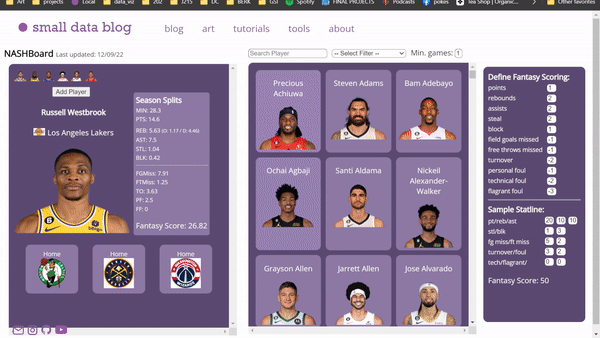

### 202 Final Implementation Project: NASHBoard - a Fantasy Basketball Companion Tool

#### Link to tool: [NASHBoard](https://www.smalldata.blog/tools/NASHBoard)

#### Link to Github: [Github](https://github.com/tylerwu2222/small-data-blog/tree/master/src/components/Tools/NASHBoard)

#### Project Overview
This project strives to create a dashboard for fantasy basketball managers. Allowing them to explore NBA players' stats as well as the players' games for the current week in *a single* aggregated tool. Using faceted categories, player can conduct a more fine-tuned search by concurrently sorting through multiple categories at once. Users can also store persisting data by choosing players to keep on their team.

#### Project Specifications
- The tool was created using React.js as a standalone page on my [blog](smalldata.blog). 
- The blog is hosted using Google App Engine.

#### Obtaining the Data
The most difficult part of this project was obtaining the data. There were technical difficulties with obtaining the data from the stats.nba website directly or from APIs that indirectly called stats.nba (CORS policy).

Thus, I tried emailing the support team from the fantasy app I use (Sleeper Fantasy). They told me that they use an API called [sportradar API](https://developer.sportradar.com/docs/read/basketball/NBA_v7#nba-api-overview), specifically their NBA v7 API. To use the API, I created a developer account, then using the API key, I accessed and cleaned data from specific endpoints, storing them for use in JSON files.

Ideally, I would store this data in a back-end database, but was unable to figure out how to do so I used local JSON files as a workaround. I was able to obtain the majority of player and team data from this API, but some specific data like player headshots and team logos I was able to obtain using nba.com and the python api, [nba_api](https://github.com/swar/nba_api).

#### Main Features
###### Player Searching & Filtering
The first feature, searching and sorting for players

###### Player Search Results
The SearchResults section shows the matched players as cards, with the player name and their headshot. Initially the players are sorted alphabetically, but can be re-sorted through filters.

###### Player Display
The PlayerDisplay on the left shows essential player info:
- Player name, team, headshot
- Season averages
- Injury status (if relevant)
- Weekly schedule; showing opponent team for each game

When the user clicks on a weekly game, the average opposition stats of the opponent team wil show up. This can help inform users about which game their player may do better in, and help them pick a game (for fantasy modes that involve picking a game).

###### Saving Players to your "Team"
By clicking the "Add Player" button, users can add the currently displayed player to their "team". This is stored in the localStorage of the browser, so the information persists across user sessions.

The user can also remove a player if they no longer want to track them on their team. 

###### Custom Fantasy Scoring
Users are able to define their own fantasy scoring by changing the multipliers for each stat.

Changes made to fantasy scoring will be automatically reflected in the sample statline and all players' fantasy score on the PlayerDisplay section.

#### Incorporation of Class Concepts
The main concept I incorporated in this project is the concept of **faceted search**. When conducting search with the NASHBoard, each filter the user modifies is applied instantaneously to the displayed players.

This was done through the useEffect feature of React such that when any facet was modified, a "central" filtering function was called that checked the value of each facet, applying it to the original data:

    useEffect(() => {
        setMatchedPlayers(runFilters())
    }, [searchTerm, selectedFilter, minGames]);

    const runFilters = () => {
        let filteredPlayers;
        // 1) filter for number of games
        filteredPlayers = changeMinGames();

        // 2) filter by search query
        filteredPlayers = searchPlayer(filteredPlayers);

        // 3) sort by statistic
        filteredPlayers = sortPlayers(filteredPlayers);

        return filteredPlayers;
    };

While there was no seperate breadcrumb tracking,the user's current search filter is always kept visible in the filter input since the results auto-refresh and there is no explicit searching action (submitting a form).

Another feature I wanted to include was a strong **information scent**. To make it clear which features could be clicked on, I either kept the element visually as a button or input. In the case of a clickable `
`, I added a hover effect where the div's background would light up and the cursor would change to a pointer:

#### Future Implementations
In the future, these are the features I would like to add.
- Storing the data in a database rather than through JSONs on my own device
- Writing a script that automatically updates the data every week
- Weekly player matchup data in addition to weekly team info calculate via minutes for a given team
- a "Fantasy Journal" on the sidebar that allows users to expand beyond the given statistics by writing down their observations about teams and players that they get through watching games
- more faceting options: player's team, only looking at stats from last `n` games
- viewing all overall team stats in one location (as opposed to clicking through the PlayerDisplay)

